# Parcial - Base de Datos y Backend
**Estudiante:** Dilan Duvan Avila Fuentes  
**Proyecto:** Cars y Tuitions  
**Motores:** PostgreSQL y MySQL

---

## Tabla de Contenido
1. [Cars](#1-cars)
2. [Tuitions](#2-tuitions)

---

## 1. Cars

### Modelo

Para este modelo defini los campos que pide el diagrama, le agregue las validaciones para que no se puedan ingresar datos incorrectos, por ejemplo la clase solo acepta los valores que yo defini y el modelo del carro no puede ser menor a 1900.

```typescript
export const Car = sequelize.define("CARS", {
  car_id: { type: DataTypes.INTEGER, primaryKey: true, autoIncrement: true },
  marca: { type: DataTypes.STRING, allowNull: false },
  clase: { type: DataTypes.STRING, allowNull: false },
  modelo: { type: DataTypes.INTEGER, allowNull: false },
  cilindraje: { type: DataTypes.FLOAT, allowNull: false },
  capacidad: { type: DataTypes.INTEGER, allowNull: false }
});
```

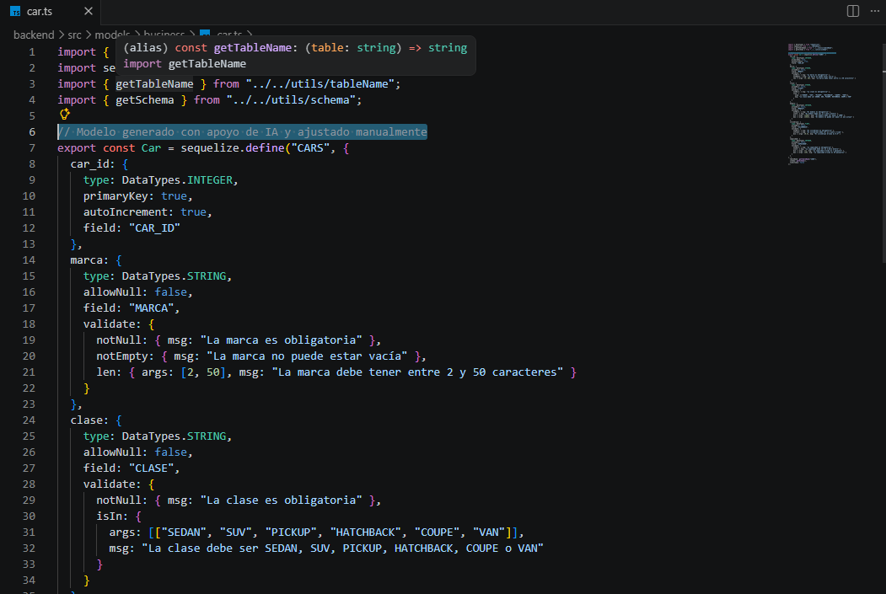

### Controlador

El controlador tiene los 5 metodos del CRUD, tambien le agregue el manejo de errores para que cuando se envie un dato incorrecto salga el mensaje de la validacion y no un error generico.

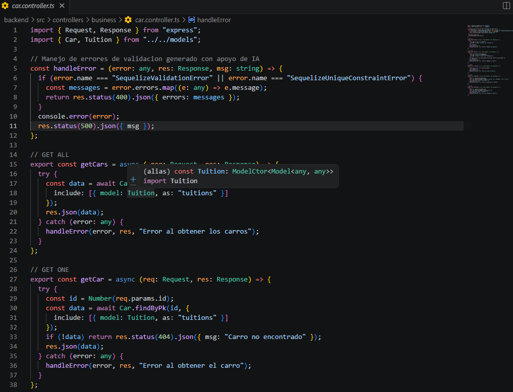

### Rutas

| Método | Endpoint | Descripción |
|--------|----------|-------------|
| GET | `/api/cars` | trae todos los carros |
| GET | `/api/cars/:id` | trae un carro por id |
| POST | `/api/cars` | crea un carro |
| PUT | `/api/cars/:id` | actualiza un carro |
| DELETE | `/api/cars/:id` | elimina un carro |

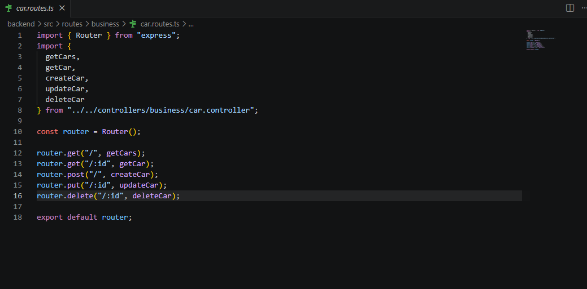

### Configuracion .env

Aqui configure las variables de entorno para conectarme tanto a postgres como a mysql, solo cambiando el DB_ENGINE puedo cambiar de motor.

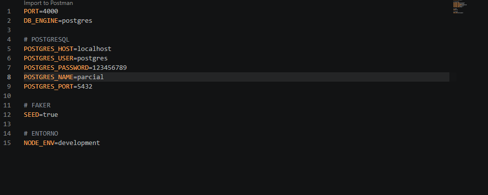

### Creacion de la tabla en PostgreSQL

Sequelize crea la tabla automaticamente cuando se inicia el servidor con sync.

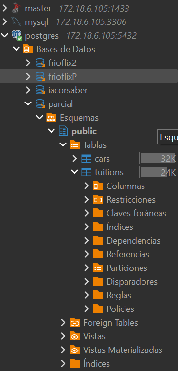

### Creacion de la tabla en MySQL

Lo mismo pero conectado a MySQL cambiando el DB_ENGINE en el .env.

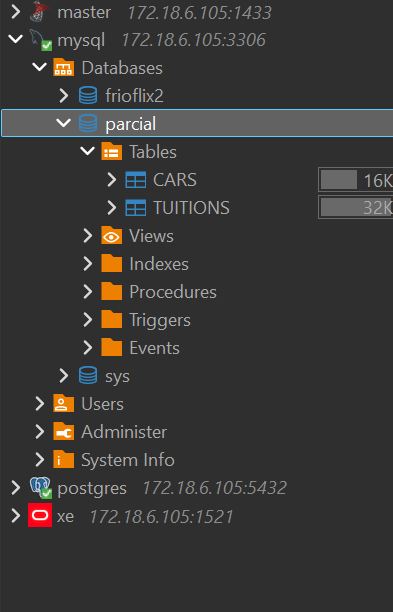

### Faker - Datos generados

Use faker para generar 20 registros de prueba, los datos los defini manualmente para que cumplan con las validaciones del modelo.

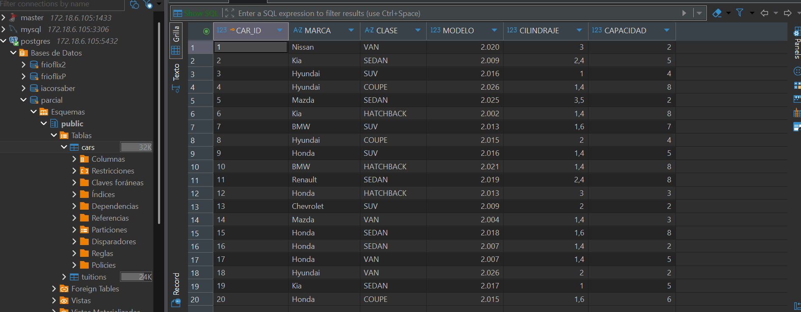

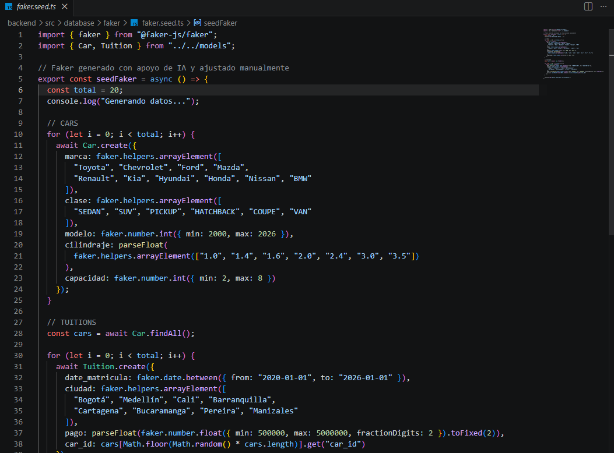

### Pruebas HTTP

#### GET ALL
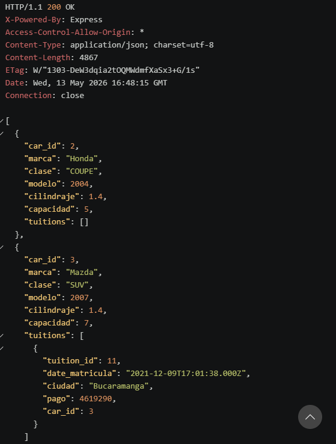

#### CREATE
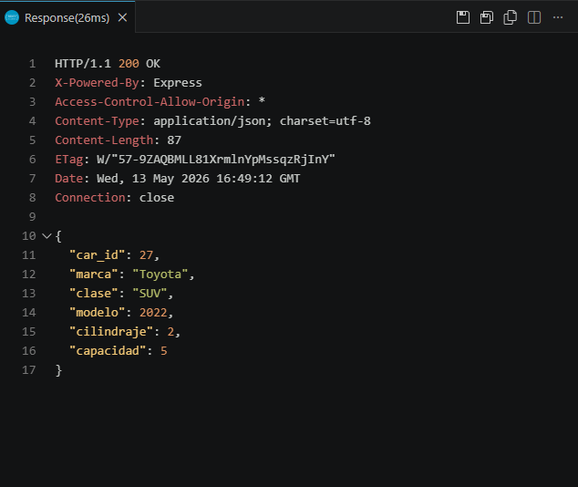

#### UPDATE
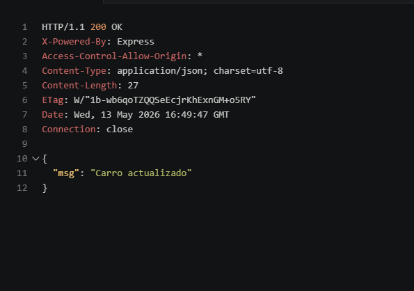

#### DELETE
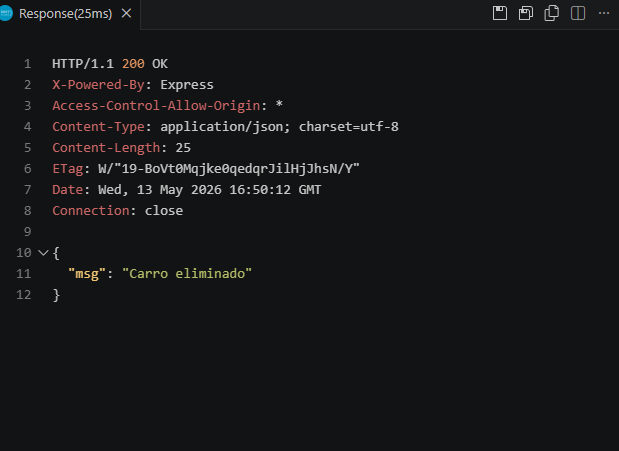

---

## 2. Tuitions

### Modelo

Este modelo tiene la llave foranea car_id que referencia a la tabla cars, eso quiere decir que para crear una matricula primero tiene que existir el carro. Tambien le puse validaciones al pago para que no sea negativo y a la ciudad para que no este vacia.

```typescript
export const Tuition = sequelize.define("TUITIONS", {
  tuition_id: { type: DataTypes.INTEGER, primaryKey: true, autoIncrement: true },
  date_matricula: { type: DataTypes.DATE, allowNull: false, defaultValue: DataTypes.NOW },
  ciudad: { type: DataTypes.STRING, allowNull: false },
  pago: { type: DataTypes.FLOAT, allowNull: false },
  car_id: { type: DataTypes.INTEGER, allowNull: false }
});
```

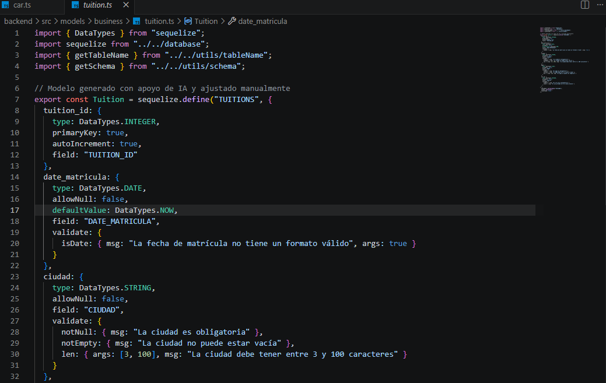

### Controlador

Igual que el de cars, tiene los 5 metodos y el manejo de errores. Cuando se hace el GET trae tambien la informacion del carro asociado gracias al include.

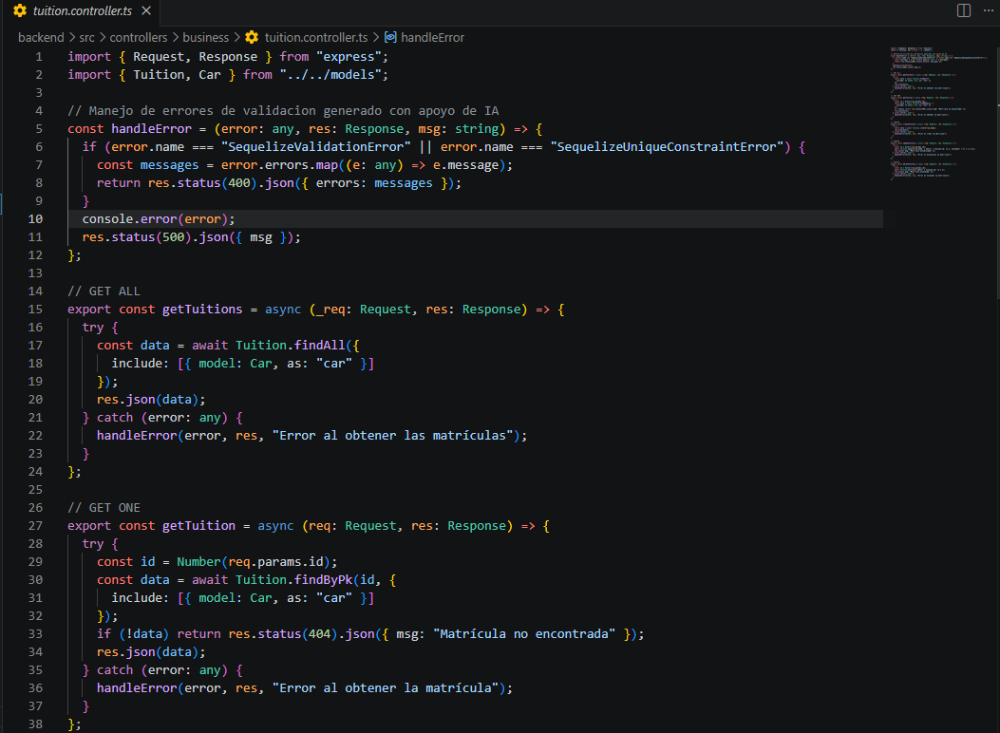

### Rutas

| Método | Endpoint | Descripción |
|--------|----------|-------------|
| GET | `/api/tuitions` | trae todas las matriculas |
| GET | `/api/tuitions/:id` | trae una matricula por id |
| POST | `/api/tuitions` | crea una matricula |
| PUT | `/api/tuitions/:id` | actualiza una matricula |
| DELETE | `/api/tuitions/:id` | elimina una matricula |

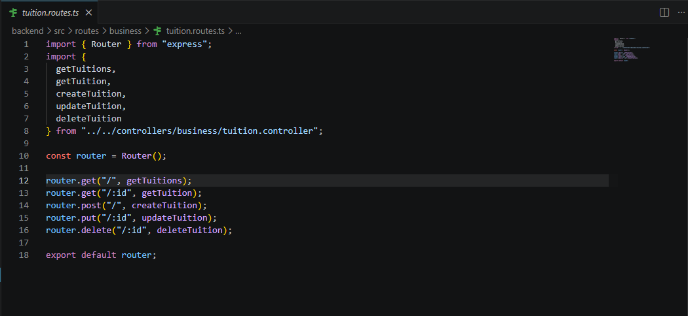

### Faker - Datos generados

Para las tuitions el faker primero consulta los carros existentes y les asigna un car_id aleatorio de los que ya existen en la base de datos para no violar la llave foranea.

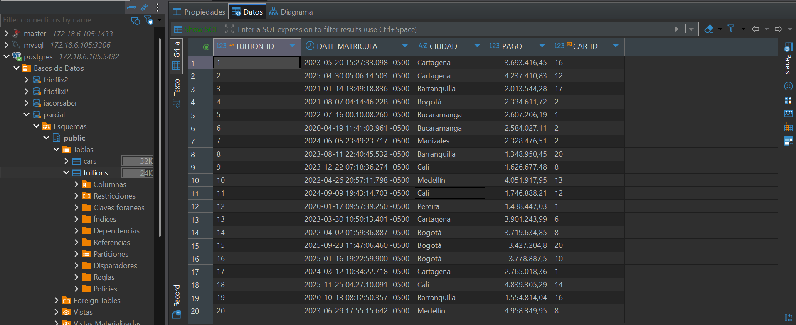

### Pruebas HTTP

#### GET ALL
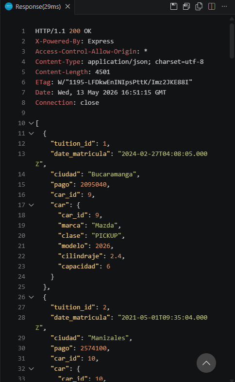

#### CREATE
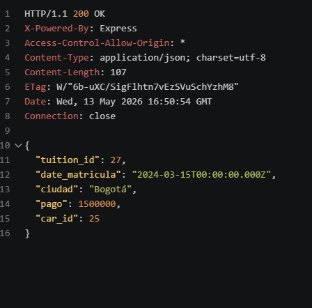

#### UPDATE
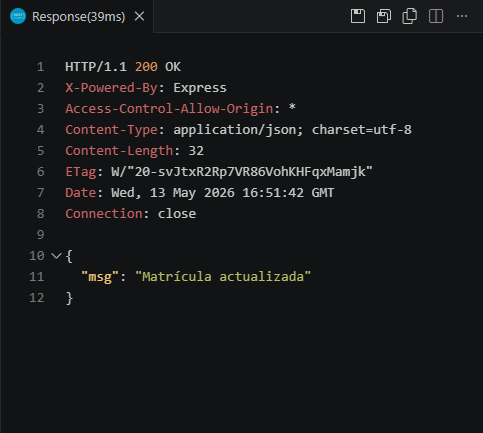

#### DELETE
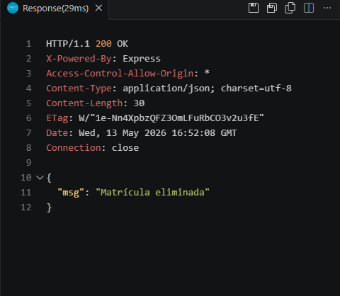
